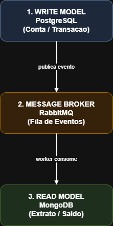
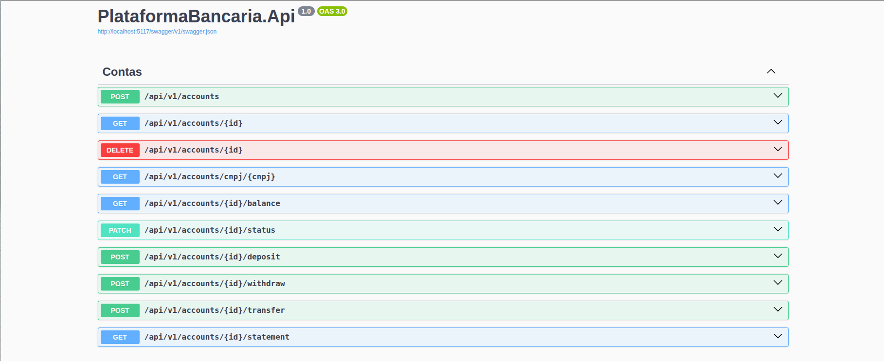

# Plataforma Bancária - Desafio Inovamobil

Este repositório contém a solução para o desafio de Desenvolvedor Backend .NET, focado na construção de uma Plataforma de Contas Bancárias. O sistema foi desenhado para ser altamente escalável, utilizando separação de responsabilidades para escrita e leitura de dados, além de comunicação assíncrona.

## 🎯 Sobre
Este projeto consiste no desenvolvimento de uma Plataforma Bancária, permitindo a abertura de contas exclusivamente via CNPJ e o processamento de transações financeiras como depósitos, saques e transferências. Mais do que um fluxo financeiro tradicional, o objetivo central foi construir um motor bancário robusto e distribuído. A arquitetura foi desenhada para impedir duplicidade de transações através de idempotência e garantir consultas dos clientes, orquestrando múltiplos bancos de dados e mensageria assíncrona.

### 🛠️ Ferramentas e Tecnologias

1. **Padrões Arquiteturais**
* **Domain-Driven Design (DDD):** O sistema foi modelado focando no núcleo do negócio, separando as responsabilidades em camadas claras e utilizando conceitos estruturais como Aggregates, Value Objects e Domain Events. Isolando as regras bancárias de tecnologias ou frameworks externos, permitindo que a aplicação evolua sem quebrar o sistema.
* **CQRS (Command Query Responsibility Segregation):** Foi implementada a separação estrita entre a intenção de modificar dados (Commands) e a intenção de ler dados (Queries). O lado de escrita foi direcionado ao banco relacional, enquanto o lado de leitura foi direcionado a um banco NoSQL para projeções rápidas. Elimina gargalos de performance. Consultas massivas de saldo e extrato não afetam a velocidade de operações críticas, como transferências.
* **Event-Driven Architecture (Arquitetura Orientada a Eventos):** A comunicação entre as ações do usuário e a consolidação dos dados foi feita de forma assíncrona, publicando e consumindo mensagens através de um message broker. Garante alta disponibilidade. Se o banco de leitura cair, a API não trava para o usuário; as transações aguardam na fila e o sistema atinge a "consistência eventual" quando se recuperar.
       
2. **Lógica**
* **Event Sourcing (Abordagem Prática):** O saldo da conta (`/balance`) não é um número estático no banco de leitura; ele é calculado dinamicamente em tempo real através da soma do histórico de eventos financeiros (transferências, depósitos e saques) armazenados na coleção de transações. Isso traz consistência matemática absoluta e cria um histórico de auditoria à prova de fraudes.
* **Idempotência:** Foi implementada uma barreira de proteção utilizando a `idempotencyKey` enviada pelo cliente nas operações financeiras. Isso garante que, em caso de falha na rede ou reenvio acidental, a mesma transação não seja processada e debitada duas vezes.
* **Fail-Fast Validations:** Utilização de validações de borda para interceptar dados inválidos imediatamente (antes de chegarem ao domínio ou ao banco de dados), garantindo os inputs. Impede que o sistema processe cobranças duplicadas caso a internet do usuário oscile e ele envie a mesma requisição financeira duas vezes. Economiza recursos rejeitando requisições com dados sujos antes mesmo de baterem no banco de dados.
3. **Ferramentas**
* **C# e .NET 8 (ASP.NET Core):** O framework principal e runtime utilizados para erguer a API REST. 
* **PostgreSQL e Entity Framework Core:** O banco de dados de escrita (Write Model) e o ORM responsáveis por garantir a integridade relacional.
  - O Postgres foi a escolha ideal por equilibrar familiaridade técnica e performance. Por um lado, facilita a modelagem e a integração devido à minha experiência prévia. Por outro, traz a maturidade necessária para uma arquitetura CQRS: seu rigor na integridade dos dados e o controle eficiente de concorrência via MVCC garantem a segurança indispensável para transações como saques e depósitos, tratando qualquer falha de forma imediata. 
  - Para operações críticas como criar uma conta ou fazer um depósito, a API conversa com o banco relacional PostgreSQL através do **Entity Framework Core (EF Core)**. O EF Core atua como um tradutor que transforma os nossos objetos em C# em tabelas no banco. Quando recebemos um comando de depósito, a API utiliza o método `_dbContext.Add()` para preparar a nova transação e, em seguida, chama o `_dbContext.SaveChangesAsync()`.
  - O `SaveChangesAsync` garante a integridade da transação. Se houver qualquer erro no meio do processo de uma transferência, ele cancela a operação inteira, garantindo que o dinheiro não suma do sistema.
* **MongoDB:** O banco de dados de leitura (Read Model) voltado para altíssima performance em consultas sem bloqueios.
   - Ao contrário do PostgreSQL, que exige operações de `JOIN` custosas para montar informações de múltiplas tabelas, o MongoDB armazena dados em formato de documentos (BSON). Isso significa que, quando o cliente pede um extrato, a API não precisa "calcular" ou cruzar tabelas; ela simplesmente busca o documento pré-montado, entregando tempos de resposta em milissegundos e suportando milhares de leituras simultâneas sem onerar o banco de escrita.
   - Para exibir o saldo ou o extrato rapidamente, a API conversa com o banco NoSQL MongoDB através do **MongoDB Driver**. Como o Mongo salva os dados em formato de documentos, a busca é muito mais direta.
   - Para gerar o extrato, a API utiliza a função `_collection.FindAsync()`, passando o ID da conta como filtro. Em seguida, usa o `ToListAsync()` para empacotar todo o histórico financeiro e devolver para a tela do usuário.
   - Sem necessidade de fazer cruzamentos de tabelas. A API vai direto ao ponto, puxa o documento do cliente e entrega a resposta.
* **RabbitMQ e MassTransit:** O agente de mensagens e a abstração utilizada para publicar eventos e criar os Workers (consumidores) de forma resiliente.]
  - O RabbitMQ foi escolhido por ser o padrão ouro para roteamento transacional e garantia de entrega de eventos de negócios ("Transferência Realizada", "Depósito Realizado"). Para viabilizar essa integração de forma robusta e limpa, foi adotado a biblioteca `MassTransit`, que abstraiu toda a complexidade de infraestrutura do RabbitMQ, permitindo focar 100% em garantir a Consistência Eventual entre a API e o *Worker*.
  - Para manter a API rápida, ela nunca salva dados no Postgres e no Mongo ao mesmo tempo. Após salvar um depósito no Postgres com sucesso, a API utiliza a função `_publishEndpoint.Publish()` da biblioteca MassTransit. Isso simplesmente envia um "aviso" (evento) para a fila do RabbitMQ. Imediatamente após enviar o aviso, a API libera o usuário. Em segundo plano, o nosso Worker escuta esse aviso e usa a função `InsertOneAsync()` do MongoDB para atualizar o extrato.
 
<p align="center">
  
</p>

* **Docker e Docker Compose:** Junta os cinco serviços exigidos (`api`, `worker`, `postgres`, `mongodb`, `rabbitmq`) para que subam juntos com um único comando. Tornando mais fácil instalação e compilação do código, fazendo com que seja levantada por qualquer desenvolvedor com um único comando, sem instalar dependências manuais.
4. **Integrações Externas**
* **ReceitaWS:** O sistema se comunica com a API da Receita Federal (ReceitaWS) para validar e capturar ativamente os dados da empresa (RazaoSocial) através do CNPJ no momento da abertura da conta.
   - Valida se o CNPJ é real no momento da abertura da conta e captura automaticamente a "Razão Social", mitigando erros de digitação e tentativas de fraude.

## 📡 Documentação da API e Exemplos de Uso

A API atua como a ponte de comunicação direta entre o usuário e o motor do banco. Ela foi desenvolvida especificamente para processar e organizar as principais operações financeiras do dia a dia: depósitos, saques, transferências, além de consultas em tempo real de saldo e extrato. Quando uma ação é solicitada (como enviar dinheiro para outra conta), a API recebe esse pedido, valida se todas as regras de segurança estão sendo respeitadas e orquestra a atualização dos valores no sistema.

Centralizar essas operações em uma API garante que as regras de negócio fiquem blindadas em um único lugar. Isso traz uma flexibilidade enorme: o nosso motor financeiro pode ser facilmente conectado a qualquer interface no futuro, mantendo exatamente o mesmo padrão de segurança e rapidez, sem precisar reescrever o código.



A interface da nossa API foi desenhada para ser intuitiva. Ela é dividida nos seguintes blocos de funcionalidades:

**1. Gerenciamento de Contas (Cadastro e Status)**

#### `POST /api/v1/accounts` (Abrir Conta)
Cria uma nova conta corporativa. Note que não enviamos a "Razão Social", pois a API consulta o CNPJ diretamente na **ReceitaWS** para garantir a veracidade dos dados.
*   **O que recebe (Request):**
```json
    {
      "cnpj": "11222333000181",
      "agencia": "0001"
    }
```
*   **O que retorna (Response - 200 OK):**
```json
    {
      "id": "3fa85f64-5717-4562-b3fc-2c963f66afa6",
      "cnpj": "11222333000181",
      "razaoSocial": "EMPRESA EXEMPLO TECNOLOGIA LTDA",
      "agencia": "0001",
      "status": "Ativa"
    }
```
* **Cenários Testados:**
    *   Se enviar um CNPJ com formato inválido -> Retorna `400 Bad Request`.

#### `DELETE /api/v1/accounts/{id}` (Encerrar Conta)
Faz o desligamento (Soft Delete) do cliente na plataforma. A conta não é apagada do banco, apenas muda seu status para "Encerrada".

**O que recebe:** Apenas o `id` da conta
**O que retorna:** `204 No Content`
* **Cenários Testados:**
    *   Se tentar encerrar uma conta que ainda possui dinheiro (saldo > 0) -> A camada de *Domain* barra a operação e retorna `400 Bad Request` informando que o saldo precisa ser sacado primeiro.

---

2. Movimentações Financeiras

*Nota: Todas as operações abaixo exigem uma `idempotencyKey` única enviada pelo cliente. Isso previne cobranças duplicadas em caso de falhas de internet ou duplo clique.*

#### `POST /api/v1/accounts/{id}/deposit` (Depósito)

Adiciona fundos à conta.

*   **O que recebe (Request):**
    ```json
    {
      "ContaId": "3fa85f64-5717-4562-b3fc-2c963f66afa6",
      "idempotencyKey": "deposito-inicial-001",
      "valor": 15000.00,
      "moeda": "BRL",
      "descricao": "Aporte inicial"
    }
    ```
*   **O que retorna (Response - 200 OK):**
    ```json
    {
      "mensagem": "Depósito realizado com sucesso."
    }
    ```
  * **Cenários Testados:**
     * Se enviar um valor zero ou negativo -> Retorna `400 Bad Request` pelo *FluentValidation*.
     * Se enviar a mesma `idempotencyKey` duas vezes -> A API ignora a segunda requisição para não duplicar o dinheiro.

#### `POST /api/v1/accounts/{id}/withdraw` (Saque)
Retira valores da conta.

*   **O que recebe (Request):**
    ```json
    {
      "ContaId": "3fa85f64-5717-4562-b3fc-2c963f66afa6",
      "idempotencyKey": "saque-caixa-001",
      "valor": 500.00,
      "moeda": "BRL",
      "descricao": "Saque em caixa eletrônico"
    }
    ```
*   **O que retorna (Response - 200 OK):**
    ```json
    {
      "mensagem": "Saque realizado com sucesso."
    }
    ```
    
*   **Cenários Testados:**
     * Se tentar sacar um valor maior do que o saldo atual da conta -> A operação é barrada (Fail-Fast) e retorna `400 Bad Request`.

#### `POST /api/v1/accounts/{id}/transfer` (Transferência)
Move dinheiro entre duas contas diferentes.

*Nota: acima de todos os metódos tem uma caixa de input onde é colocado o id da conta, nesse caso ele vai ser a conta que vai mandar o dinheiro e no script vai ser a conta de quem vai receber o dinheiro.*

*   **O que recebe (Request):**
    ```json
    {
      "idempotencyKey": "pagamento-fornecedor-001",
      "contaDestinoId": "1b9d6bcd-bbfd-4b2d-9b5d-ab8dfbbd4bed",
      "valor": 4500.00,
      "moeda": "BRL",
      "descricao": "Pagamento de serviços prestados"
    }
    ```
*   **O que retorna (Response - 200 OK):**
    ```json
    {
      "mensagem": "Transferência realizado com sucesso."
    }
    ```
*   **Cenários Testados:**
     * Se a conta de destino estiver com status "Encerrada" ou não existir -> A transferência é negada (`400 Bad Request`).

---

### 3. Consultas (Leitura em Alta Performance - MongoDB)
#### `GET /api/v1/accounts/{id}/balance` (Ver Saldo)
Consulta que lê os dados consolidados diretamente do MongoDB, sem sobrecarregar o banco relacional.

*   **O que recebe (Request):**
     `id` da Conta em uma caixa de input.
*   **O que retorna (Response - 200 OK):**
  ```json
    {
     "saldo": 10010
    }
``` 

#### `GET /api/v1/accounts/{id}/statement` (Ver Extrato)
Traz o histórico completo (*Event Sourcing*) de tudo o que aconteceu na conta (entradas e saídas).

*   **O que recebe (Request):**
     `id` da Conta em uma caixa de input.

*   **O que retorna (Response - 200 OK):**
  ```json
[
    {
    "id": "6a544698f37eeac7515d9546",
    "contaId": "89524465-2af6-44a9-9cb3-7dc14aa7b118",
    "tipo": "Deposito",
    "valor": 10000,
    "dataOcorrencia": "2026-07-13T01:59:52.718Z"
  },
  {
    "id": "6a542eb8e142e9ed1ed6a521",
    "contaId": "89524465-2af6-44a9-9cb3-7dc14aa7b118",
    "tipo": "Transferencia",
    "valor": -250,
    "dataOcorrencia": "2026-07-13T00:18:00.552Z"
  },
  {
    "id": "6a540c684b07c864450c60be",
    "contaId": "89524465-2af6-44a9-9cb3-7dc14aa7b118",
    "tipo": "Transferencia",
    "valor": 250,
    "dataOcorrencia": "2026-07-12T21:51:35.953Z"
  }
]
``` 

## 📂 Estrutura do Projeto

```text
📦 DESAFIO-BACKEND-INOVAMO
 ┣ 📂 PlataformaBancaria.Api
 ┃ ┣ 📂 Controllers
 ┃ ┃ ┗ 📜 ContasController.cs
 ┃ ┣ 📂 Properties
 ┃ ┃ ┗ 📜 launchSettings.json
 ┃ ┣ 📜 appsettings.Development.json
 ┃ ┣ 📜 appsettings.json
 ┃ ┣ 📜 Dockerfile
 ┃ ┣ 📜 PlataformaBancaria.Api.csproj
 ┃ ┣ 📜 PlataformaBancaria.Api.http
 ┃ ┗ 📜 Program.cs
 ┃
 ┣ 📂 PlataformaBancaria.Application
 ┃ ┣ 📂 Commands
 ┃ ┃ ┣ 📂 Contas
 ┃ ┃ ┃ ┣ 📜 AbrirContaCommand.cs
 ┃ ┃ ┃ ┣ 📜 AbrirContaCommandHandler.cs
 ┃ ┃ ┃ ┣ 📜 AlterarStatusContaCommand.cs
 ┃ ┃ ┃ ┣ 📜 AlterarStatusContaCommandHandler.cs
 ┃ ┃ ┃ ┣ 📜 EncerrarContaCommand.cs
 ┃ ┃ ┃ ┗ 📜 EncerrarContaCommandHandler.cs
 ┃ ┃ ┗ 📂 Operacoes
 ┃ ┃   ┣ 📜 RealizarDepositoCommand.cs
 ┃ ┃   ┣ 📜 RealizarDepositoCommandHandler.cs
 ┃ ┃   ┣ 📜 RealizarSaqueCommand.cs
 ┃ ┃   ┣ 📜 RealizarSaqueCommandHandler.cs
 ┃ ┃   ┣ 📜 RealizarTransferenciaCommand.cs
 ┃ ┃   ┗ 📜 RealizarTransferenciaCommandHandler.cs
 ┃ ┣ 📂 DTOs
 ┃ ┃ ┣ 📜 ContaResponseDto.cs
 ┃ ┃ ┣ 📜 CriarContaRequestDto.cs
 ┃ ┃ ┣ 📜 RealizarDepositoRequestDto.cs
 ┃ ┃ ┗ 📜 RealizarSaqueRequestDto.cs
 ┃ ┣ 📂 Events
 ┃ ┃ ┣ 📜 DepositoRealizadoEvent.cs
 ┃ ┃ ┣ 📜 SaqueRealizadoEvent.cs
 ┃ ┃ ┗ 📜 TransferenciaRealizadaEvent.cs
 ┃ ┣ 📂 Queries
 ┃ ┃ ┗ 📂 Contas
 ┃ ┃   ┣ 📜 ObterContaPorCnpjQuery.cs
 ┃ ┃   ┣ 📜 ObterContaPorCnpjQueryHandler.cs
 ┃ ┃   ┣ 📜 ObterContaPorIdQuery.cs
 ┃ ┃   ┣ 📜 ObterContaPorIdQueryHandler.cs
 ┃ ┃   ┣ 📜 ObterSaldoQuery.cs
 ┃ ┃   ┣ 📜 ObterSaldoQueryHandler.cs
 ┃ ┃   ┗ 📜 ObterExtratoQuery.cs
 ┃ ┣ 📂 Services
 ┃ ┃ ┣ 📂 Interfaces
 ┃ ┃ ┃ ┗ 📜 IContaAppService.cs
 ┃ ┃ ┗ 📜 ContaAppService.cs
 ┃ ┣ 📜 Class1.cs
 ┃ ┗ 📜 PlataformaBancaria.Application.csproj
 ┃
 ┣ 📂 PlataformaBancaria.Domain
 ┃ ┣ 📂 Entities
 ┃ ┃ ┣ 📜 ChaveIdempotencia.cs
 ┃ ┃ ┣ 📜 Conta.cs
 ┃ ┃ ┗ 📜 Transacao.cs
 ┃ ┣ 📂 Enums
 ┃ ┃ ┗ 📜 TipoTransacao.cs
 ┃ ┣ 📂 Repositories
 ┃ ┃ ┣ 📜 IContaRepository.cs
 ┃ ┃ ┗ 📜 IIdempotenciaRepository.cs
 ┃ ┣ 📂 Services
 ┃ ┃ ┗ 📜 IEmpresaService.cs
 ┃ ┣ 📂 ValueObjects
 ┃ ┃ ┗ 📜 Cnpj.cs
 ┃ ┗ 📜 PlataformaBancaria.Domain.csproj
 ┃
 ┣ 📂 PlataformaBancaria.Infrastructure
 ┃ ┣ 📂 Data
 ┃ ┃ ┣ 📂 Configurations
 ┃ ┃ ┃ ┣ 📜 ContaConfiguration.cs
 ┃ ┃ ┃ ┗ 📜 TransacaoConfiguration.cs
 ┃ ┃ ┗ 📜 AppDbContext.cs
 ┃ ┣ 📂 Migrations
 ┃ ┣ 📂 Repositories
 ┃ ┃ ┣ 📜 ContaRepository.cs
 ┃ ┃ ┗ 📜 IdempotenciaRepository.cs
 ┃ ┣ 📂 Services
 ┃ ┃ ┗ 📜 EmpresaService.cs
 ┃ ┣ 📜 Class1.cs
 ┃ ┗ 📜 PlataformaBancaria.Infrastructure.csproj
 ┃
 ┣ 📂 PlataformaBancaria.Worker
 ┃ ┣ 📂 Consumers
 ┃ ┃ ┣ 📜 DepositoRealizadoConsumer.cs
 ┃ ┃ ┣ 📜 SaqueRealizadoConsumer.cs
 ┃ ┃ ┗ 📜 TransferenciaRealizadaConsumer.cs
 ┃ ┣ 📂 Models
 ┃ ┃ ┗ 📜 TransacaoDocument.cs
 ┃ ┣ 📂 Properties
 ┃ ┃ ┗ 📜 launchSettings.json
 ┃ ┣ 📜 appsettings.Development.json
 ┃ ┣ 📜 appsettings.json
 ┃ ┣ 📜 Dockerfile
 ┃ ┣ 📜 PlataformaBancaria.Worker.csproj
 ┃ ┣ 📜 Program.cs
 ┃ ┗ 📜 Worker.cs
 ┃
 ┣ 📜 .gitignore
 ┣ 📜 docker-compose.yml
 ┣ 📜 PlataformaBancaria.sln
 ┗ 📜 README.md
```


## 🚀 Como Executar o Projeto

O projeto foi totalmente conteinerizado utilizando **Docker** para garantir que a aplicação, os bancos de dados e o sistema de mensageria rodem em qualquer ambiente de forma isolada, padronizada e sem a necessidade de instalações locais complexas.

### Pré-requisitos
Antes de começar, certifique-se de ter as seguintes ferramentas instaladas na sua máquina:
* **[Git](https://git-scm.com/)** (Para clonar o repositório)
* **[Docker](https://www.docker.com/)** e **Docker Compose** (Para orquestrar os contêineres)

### Passo a Passo

1. **Clone o repositório**

Abra o seu terminal e execute o comando abaixo para baixar o código-fonte:

SSH
```bash
git clone git@github.com:otaviohiratsuka/desafio-backend-inovamobil.git
```

HTTPS
```bash
git clone https://github.com/otaviohiratsuka/desafio-backend-inovamobil.git
```


2. **Acesse a pasta do projeto**

Navegue até o diretório raiz do repositório clonado:

```bash
cd <desafio-backend-inovamobil>
```


3. **Suba a infraestrutura**

Na raiz do projeto (onde está localizado o arquivo `docker-compose.yml`), execute o comando abaixo para construir as imagens e levantar todos os microsserviços (API, Worker, PostgreSQL, MongoDB e RabbitMQ):
```bash
docker compose up --build
```


4. **Aguarde a inicialização**
   
O sistema estará pronto para uso quando os logs do terminal indicarem que o ``plataforma-api`` está escutando as requisições e o ``plataforma-worker`` declarou que se conectou com sucesso ao RabbitMQ.

5. **Acessos Úteis**

Com a infraestrutura rodando, você pode interagir com o sistema e monitorar os bastidores através dos seguintes links no seu navegador:

Interface interativa para testar os Commands (abrir conta, depósito, saque, transferência) e Queries (saldo, extrato).

`http://localhost:5117/swagger/index.html` (Ajuste a porta caso tenha mapeado diferente)

Interface visual para monitorar a saúde do Message Broker, visualizar a criação das filas (Ex: `transferencia-realizada-queue`) e o tráfego dos eventos de domínio.

`http://localhost:15672`

Usuário: `guest` | Senha: `guest`

6. **Parar a aplicação**

Para encerrar a execução de forma segura e desligar todos os contêineres, pressione `CTRL+C` no terminal onde os logs estão rodando.

Como alternativa, você pode abrir uma nova aba do terminal na raiz do projeto e executar
```bash
docker compose down
```

## 👤 Autor

Desenvolvido por Otávio Hiratsuka Camilo;

Aluno do curso de Engenharia da Computação no [CEFET-MG](https://www.cefetmg.br)

### Entre em contato

<div> 
  <a href = "[mailto:otaviohiratsukac@gmail.com](https://github.com/otaviohiratsuka)"></a>
  <a href = "mailto:otaviohiratsukac@gmail.com"></a>
  <a href="https://www.linkedin.com/in/otaviohiratsuka/" target="_blank"></a>  
</div>

